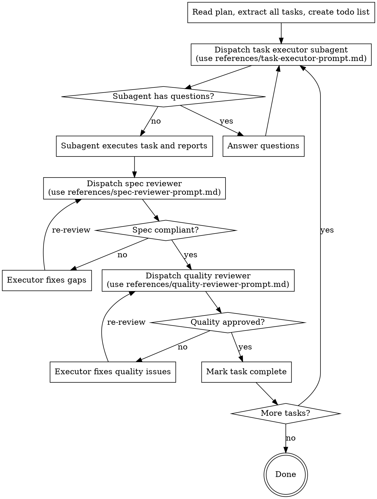

# Subagent-Driven Execution

## Overview

Dispatch one fresh subagent per task. Each subagent starts with zero context from prior tasks — no drift, no confusion. Two-stage review after each task: first verify the output matches the task spec, then verify quality.

**Core principle:** Fresh subagent per task + two-stage review = high-quality, fast iteration without context pollution.

## Process

## Prompt Templates

- `references/task-executor-prompt.md` — template for dispatching a task executor subagent
- `references/spec-reviewer-prompt.md` — template for verifying output matches the task spec
- `references/quality-reviewer-prompt.md` — template for verifying output quality

## Handling Executor Status

| Status | Action |
|---|---|
| **DONE** | Proceed to spec review |
| **DONE_WITH_CONCERNS** | Read concerns before proceeding; if correctness doubts, address first |
| **NEEDS_CONTEXT** | Provide missing context, re-dispatch |
| **BLOCKED** | Diagnose: provide more context, use a more capable model, or break the task into smaller pieces |

## Rules

- One task per subagent — never share context between subagents
- Provide full task text to subagent — do not make them read the plan file
- Run spec review BEFORE quality review — wrong order wastes effort
- Do not proceed with open issues — reviewer found issues = executor fixes = review again
- Do not pause between tasks to ask the user — execute the full plan unless genuinely blocked

## Examples

**Example 1: Quarterly report package**
User: "Execute the plan to produce our Q2 board report — financials, market summary, and exec commentary."
Applied: Each section is dispatched to a separate subagent with the full task text. After each section is returned, a spec reviewer then a quality reviewer check the output before the next section begins.
Result: Three clean, independently reviewed sections delivered without cross-contamination between them.

**Example 2: Vendor onboarding workflow**
User: "Run the vendor onboarding plan — NDA review, compliance checklist, and system access request."
Applied: Each step goes to its own subagent. Spec review confirms each output matches the required template; quality review checks completeness and tone before marking done.
Result: All three onboarding deliverables completed in sequence, each verified before the next starts.

**Example 3: Marketing campaign launch**
User: "Execute the campaign plan: audience brief, email sequence draft, and social copy."
Applied: The three tasks are extracted from the plan and dispatched one at a time. A spec reviewer checks each against the brief; a quality reviewer checks clarity and brand voice.
Result: Each asset is independently reviewed and approved before the next is started, producing consistent, brief-compliant copy.

## Troubleshooting

**Subagent skipped spec review and went straight to quality review**
Reverse the order. Run spec review first — always. Quality review on a spec-non-compliant output wastes effort and may pass work that misses requirements.

**Subagent is fixing issues itself instead of dispatching a fix subagent**
Stop and dispatch a new fix subagent with the reviewer's findings as input. Self-correction by the orchestrator is context pollution and bypasses the review cycle.

**Subagent checked in with the user mid-plan without a genuine blocker**
Resume execution without user input unless blocked by missing context, a failing dependency, or a genuine decision point not covered in the plan.

**Executor returned BLOCKED and the task stalled**
Diagnose before re-dispatching: provide missing context, switch to a more capable model, or break the task into smaller pieces, then re-dispatch.

**Both reviewers approved but the final output looks wrong**
Check that the task text given to the executor was complete and matched the plan. Vague task descriptions produce passing reviews of the wrong output — restate the task precisely and re-run.

## Red Flags

| Thought | Reality |
|---|---|
| "I'll skip spec review, it looks right" | Spec review catches over-building and missed requirements. Never skip. |
| "Quality review is overkill for this task" | Both reviews are required. Always. |
| "I'll just fix this myself instead of dispatching" | That's context pollution. Dispatch a fix subagent. |
| "The subagent's self-review is enough" | Self-review ≠ independent review. Both are needed. |
| "Let me check in with the user between tasks" | Execute the plan. Only stop for genuine blockers. |
