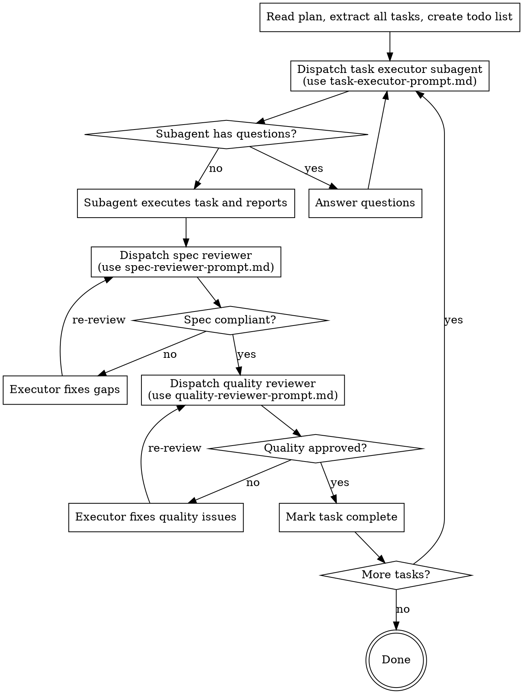

# Subagent-Driven Execution

## Overview

Dispatch one fresh subagent per task. Each subagent starts with zero context from prior tasks — no drift, no confusion. Two-stage review after each task: first verify the output matches the task spec, then verify quality.

**Core principle:** Fresh subagent per task + two-stage review = high-quality, fast iteration without context pollution.

## Process

## Prompt Templates

- `task-executor-prompt.md` — template for dispatching a task executor subagent
- `spec-reviewer-prompt.md` — template for verifying output matches the task spec
- `quality-reviewer-prompt.md` — template for verifying output quality

## Handling Executor Status

| Status | Action |
|---|---|
| **DONE** | Proceed to spec review |
| **DONE_WITH_CONCERNS** | Read concerns before proceeding; if correctness doubts, address first |
| **NEEDS_CONTEXT** | Provide missing context, re-dispatch |
| **BLOCKED** | Diagnose: provide more context, use a more capable model, or break the task into smaller pieces |

## Rules

- One task per subagent — never share context between subagents
- Provide full task text to subagent — do not make them read the plan file
- Run spec review BEFORE quality review — wrong order wastes effort
- Do not proceed with open issues — reviewer found issues = executor fixes = review again
- Do not pause between tasks to ask the user — execute the full plan unless genuinely blocked

## Red Flags

| Thought | Reality |
|---|---|
| "I'll skip spec review, it looks right" | Spec review catches over-building and missed requirements. Never skip. |
| "Quality review is overkill for this task" | Both reviews are required. Always. |
| "I'll just fix this myself instead of dispatching" | That's context pollution. Dispatch a fix subagent. |
| "The subagent's self-review is enough" | Self-review ≠ independent review. Both are needed. |
| "Let me check in with the user between tasks" | Execute the plan. Only stop for genuine blockers. |
