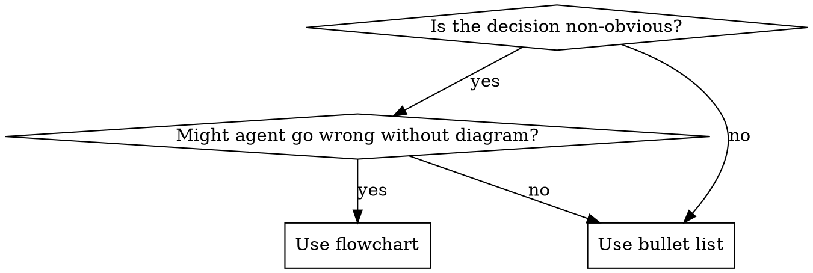

# Writing Skills

## Overview

A **skill** is a reference guide for a proven discipline or technique. It tells future Claude instances what to do in a specific situation. Skills that are too long, too vague, or poorly described get skipped or ignored.

**Core principle:** Test your skill before deploying it. Watch an agent work without the skill — document what goes wrong — then write the skill to fix exactly those failures.

**Official guidance:** For Anthropic's official skill authoring best practices, see `references/anthropic-best-practices.md`.

## What Is a Skill?

**Skills are:** Reusable techniques, process disciplines, reference guides, workflow patterns

**Skills are NOT:** One-off solutions, standard practices documented elsewhere, project-specific notes (put those in CLAUDE.md)

## Skill Types

| Type | Purpose | Examples |
|---|---|---|
| **Discipline** | Enforces a rule under pressure | brainstorming, verification-before-completion |
| **Technique** | Teaches a how-to | systematic-problem-solving, research-before-acting |
| **Reference** | Documents an API or format | tool docs, template libraries |

## SKILL.md Structure

**Frontmatter (required):**
- `name`: letters, numbers, hyphens only — no special characters
- `description`: starts with "Use when...", third person, under 500 characters, no workflow summary

**Body sections:**

```
# Skill Name

## Overview
Core principle in 1-2 sentences.

## When to Use
[Small flowchart IF the decision is non-obvious, otherwise bullet list]

## Process
[Numbered steps or checklist]

## Red Flags
[Table of rationalizations and counters]

## Quick Reference
[Table or bullets for scanning]
```

## Description Rules (Critical — CSO)

The `description` field is how Claude decides whether to load your skill. Get this wrong and the skill is invisible.

**Rules:**
- Start with "Use when..."
- Describe ONLY triggering conditions — never summarize what the skill does
- Under 500 characters
- Third person (injected into system prompt)
- **NEVER include workflow summary** — agents will follow the description and skip the skill body

```yaml
# BAD: Summarizes workflow — agent skips the skill body
description: Use when creating skills — write test first, document rationalizations, use CSO

# BAD: Too vague
description: Helps with skills

# GOOD: Triggering conditions only
description: Use when creating a new cowork skill, editing an existing skill, or verifying a skill works before sharing it
```

## Token Budget

Every token in a loaded skill competes with your actual conversation.

| Skill type | Target |
|---|---|
| Session-start skills | Under 150 words |
| Other frequently-loaded skills | Under 300 words |
| All other skills | Under 500 words |

**How to stay in budget:**
- Use tables and checklists over prose
- Cross-reference other skills rather than repeating their content: `**REQUIRED:** Use sosai-superpowers:brainstorming`
- Move heavy reference material to companion files (see File Organization below)
- One excellent example beats three mediocre ones

## Flowcharts

Use flowcharts ONLY for non-obvious decisions where an agent might take the wrong path without visual guidance.



**Never use flowcharts for:** reference material (use tables), linear instructions (use numbered lists), code examples (use code blocks).

See `references/graphviz-conventions.dot` for shape and style rules.

## File Organization

**Self-contained (most skills):**
```
skill-name/
  SKILL.md
```

**With companion files (heavy reference or reusable tools):**
```
skill-name/
  SKILL.md           # Overview + links
  references/
    reference.md     # Heavy reference (100+ lines)
    template.md      # Reusable template
```

**Rule:** Place companion files in a `references/` subdirectory. Never nest reference files inside each other — Claude may only partially read deeply nested files.

## Evaluation-Driven Creation

**Test before deploying.** If you didn't see an agent fail without the skill, you don't know if it teaches the right thing.

### Process

**1. Baseline (watch it fail)**
Run a pressure scenario without the skill. Document exact failures verbatim:
- What did the agent skip?
- What rationalizations did it use?
- Which pressures triggered the violation?

**2. Write minimal skill**
Write the skill to address those specific failures. Don't add content for hypothetical cases.

**3. Test with skill**
Run the same scenario with skill loaded. Agent should now comply.

**4. Close loopholes**
Agent found a new rationalization? Add an explicit counter. Re-test until clean.

### Scenario Types by Skill Type

| Skill type | How to test |
|---|---|
| **Discipline** | Pressure scenarios: time pressure + sunk cost + "it's almost done" combined |
| **Technique** | Application scenarios: new situation, does agent apply technique correctly? |
| **Reference** | Retrieval scenarios: ask for specific info, does agent find and use it correctly? |

## Bulletproofing Discipline Skills

Discipline skills (ones that enforce rules) need to resist rationalization. Agents are smart and will find loopholes.

**Tactics:**
- **Close every loophole explicitly** — forbid specific workarounds, not just the rule
- **Build a rationalization table** — capture excuses from baseline testing
- **Create a red flags list** — makes it easy for the agent to self-check
- **Add a hard gate** — `<HARD-GATE>` tags signal an unbreakable rule

**Example red flags list:**
```markdown
## Red Flags — Stop Immediately

- "This is too simple to need a plan"
- "I already know what to do"
- "The user is waiting — I'll start and plan as I go"
- "This is just a small change"

All of these mean: stop and follow the process.
```

See `references/anthropic-best-practices.md` for deeper guidance on writing effective skills.

## Common Mistakes

| Mistake | Fix |
|---|---|
| Description summarizes workflow | Triggering conditions only — never what the skill does |
| Skill too long | Move heavy reference to companion files |
| No examples | One concrete cowork example is better than a generic template |
| Skills without testing | Always run a pressure scenario before deploying |
| Nested reference files | All companion files linked directly from SKILL.md |
| First-person description | Third person only — description becomes system prompt text |

## Quality Checklist

Before deploying any skill:

- [ ] Description starts with "Use when..." and contains NO workflow summary
- [ ] Description is under 500 characters and third person
- [ ] All steps are actionable — no "handle appropriately" or "as needed"
- [ ] Red flags table covers common rationalizations
- [ ] Under word budget (check with word count)
- [ ] Tested: ran baseline scenario without skill, documented failures
- [ ] Tested: ran scenario with skill, agent now complies
- [ ] Companion files (if any) are in a `references/` subdirectory
- [ ] Committed to git
